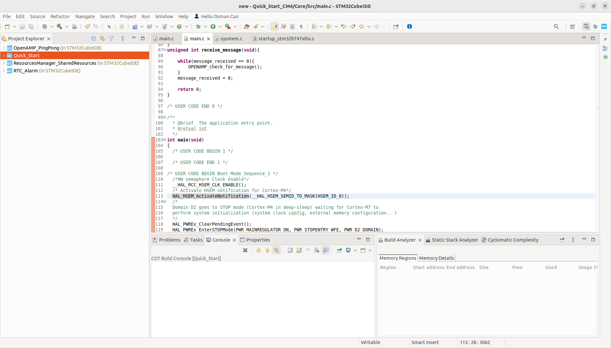
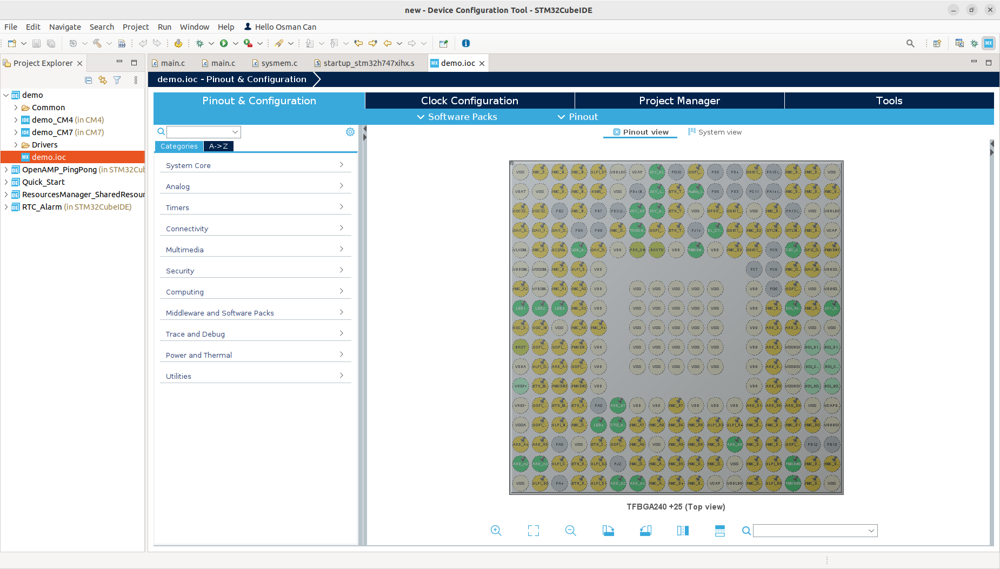
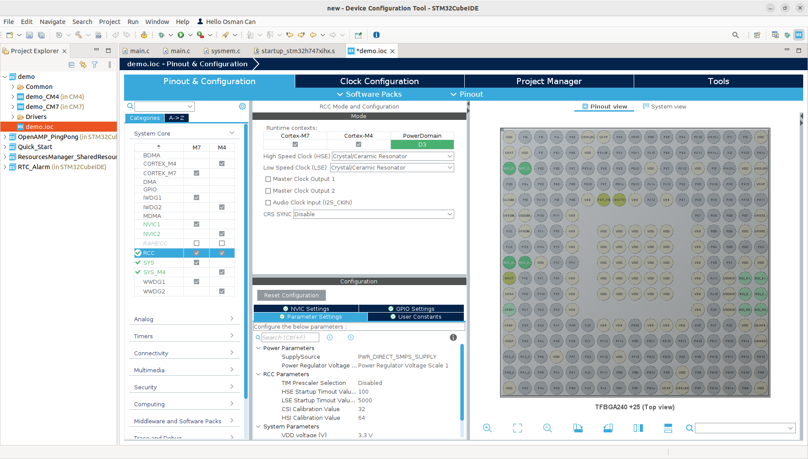
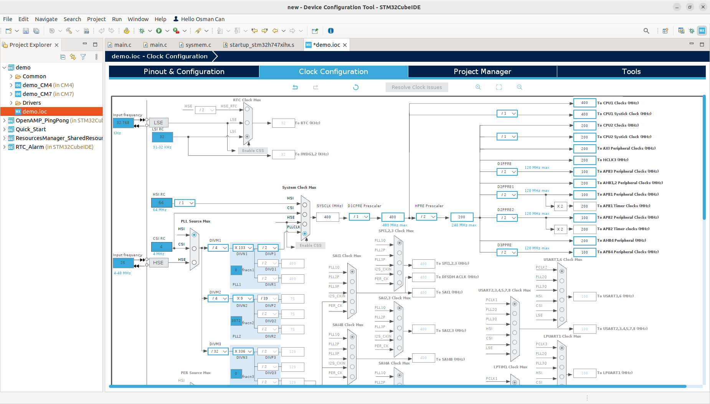
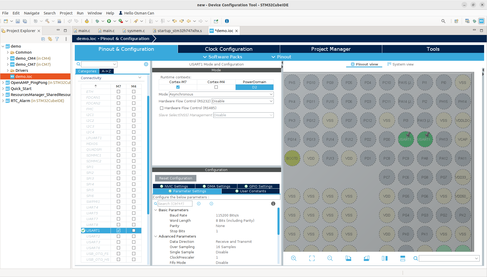
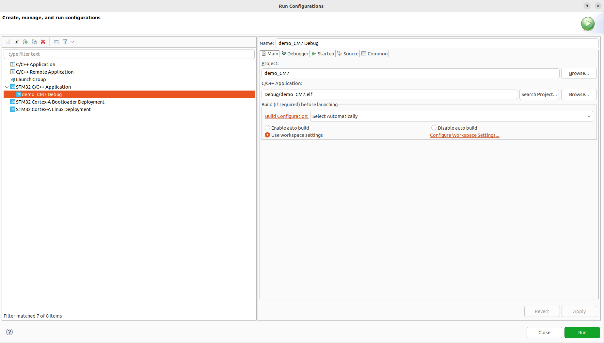
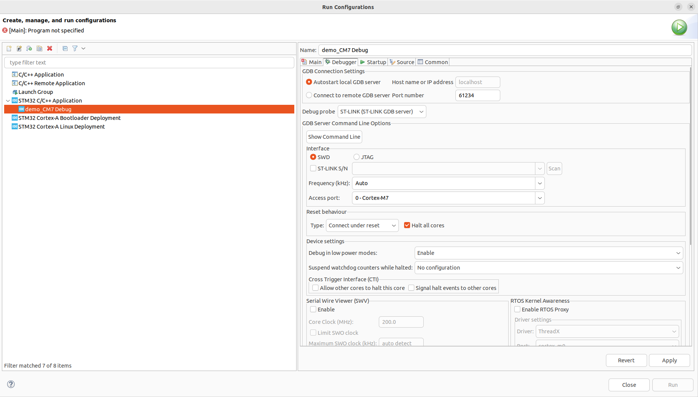
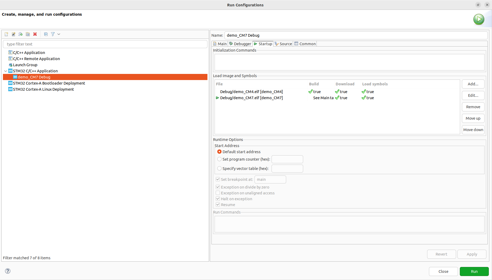
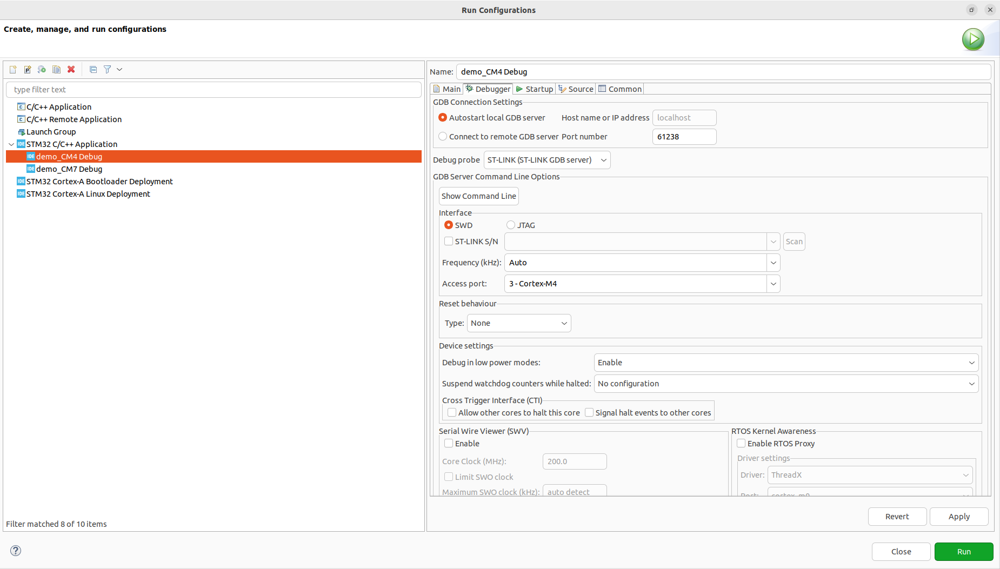
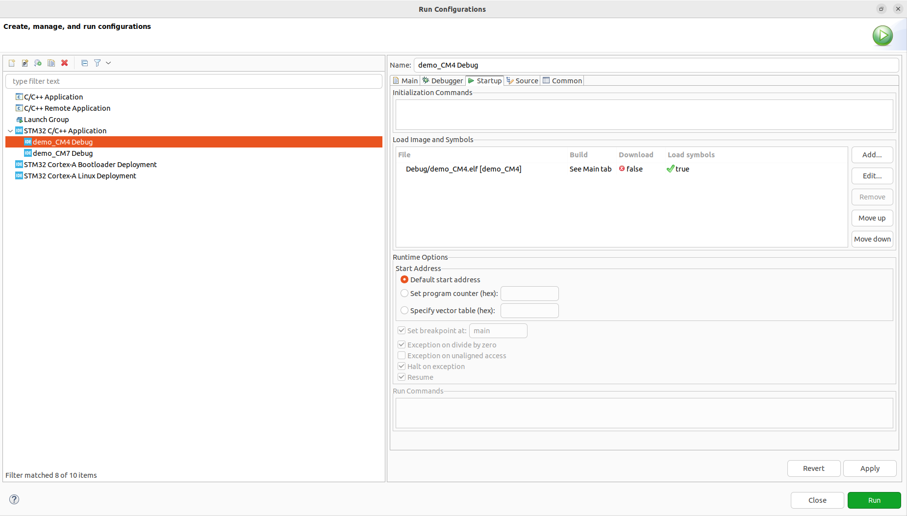

# Quick Start

Bu Örnekde en baştan stm32CubeIDE kullanılarak bir DualCore Proje oluşturup debug yapılacaktır.

## Proje Kurulumu

Öncellikle STM32CubeIDE içerisinde "File -> new -> STM32 Project"e tıklayalım.

Ana sayfa:

Açılan sayfadan Boardlar içerisinde çalışacağımız kartı seçelim. Biz bu demo'da STM32H747-DISC0 kitini seçtik. Projeyi oluşturup IOC içerisini hazırlamak için ana ekrana tekrar dönelim.

Board seçimi:

IOC içerisinde ayarlarımızı yaparken default ayarları açmadan başlatarabiliriz. Böylelikle kullanmayacağız peripharelların initleri kodumuzda yer kaplamaz. IOC içerisinde default seçmediğimiz takdirde pinlerin sarı olduğunu göreceğiz, bunlar unused pinleri temsil etmektedir. Pinout sekmesinden "Clear Pinout" seçeneğine tıkladığımız zaman bu sarı pinler silenecektir.
Bu işlemler sonrasında clock speed'i 400Mhz çekmek için RCC ayarlarına girmemiz gerekir.

IOC Menusü:

RCC sekmesi içerisinde High Speed Clock (HSE) ve Low Speed Clock(LSE )seçeneğini "Crystal/Ceramic Resonator" olarak ayarlayalım. Ek bilgi olarak Parameter Setting menusünde supplySource ve Power Regulator Voltage Scale ayarları otomatik olarak ayarlmanktadır ancak bu ayarlar farklı frekanslarda farklılık gösterebilir. Örnek olarak biz 400Mhz ile çalışacağımız için sadece Power Regulator Voltage Scale 1 ve 0 ayarı bize uyacaktır.

RCC Seçenekleri:

RCCyi ayarladıktan sonra Clock Configuration Bölümünden öncelikle System Clock Mux'ı PLLCLK'u seçim SYSCLKun kutusunun iki sağ yanındaki kutuya 400Mhz yazıp otomatik bir hesaplama yapabilirz.

Clock Ayarları:

Ekstra olarak Connectivity içerisinde USART1'i Cortex-M7 için seçip, Mode ayarını Async yapıp sonrası pinlerini PA10 ve PA9 yapıp USART çıkışını data yollamak için hazırlıyoruz. Burada Pin çıkışları karttan karta tabiki değişiklik gösterecektir.

UART Ayarları:

IOC ayarlamızı yaptığımıza göre CTRL-S'ye basarak ayarları kaydedip, Code Generationı başlatalım. Proje Dosyaları hazırlandıktan sonra karşımızda iki adet dosya olacaktır. Burada iki Core içinde ayrı projelere sahip olduğumuzu göreceksiniz. "<proje_ismi>_CM7" projesi içerisinde bulunan main.c dosyasına ekstra ayarladığımız UART'ı görmek için bir HAL_UART_TRANSMIT ekleyebiliriz. iki projeyide derlememiz gerekiyor. Bu işlemden sonra Run veya Debug Configurationı açmamız gerekiyor.

Configuration Ayarları:

Öncelikle CM7 projesini ayarlayalım, bunun için açılan sayfada "STM32 C/C++ Application"a CM7 projesi aktifken çift tıklayalım. debugger sekmesindeki değişikleri aşağıdaki resim gibi yapalım.

CM7 Debugger Ayarları:

Sonrasında Startup menusünde başlatma sırasını ayalamalıyız. Burada Add düğmesine basıp açılan sayfada Project olarak <project>_CM4'ü seçiniz ve "ok"a basınız. Sıralama aşağıdaki resim gibi olucaktır Apply'a basarak ayarlanızı kaydettmeyi unutmayınız.
CM7 Startup Ayarı:

CM7 projesini ayarlıktan sonra CM4ü aktif duruma getirip "STM32 C/C++ Application"a yine çift tıklaynız. Burada Debugger ayarlarına gelip port'u en az yukarıya götürmeniz gerekiyor biz önerilen "612238" olarak ayarlmaktır. Sonrasında Reset behaviour'ı "None" olarak ayarlayınız.

CM4 Debugger Ayarı:

Startup sekmesinde CM4 projesi için Download'ı deaktif etmeniz lazım bunun için Debug/demo_CM3.elf yazan dosyaya çift tıklayıp, açılan sekmede Download'ı uncheck ediniz. Sonrasın "OK"ye basınız. Apply'a basarak ayarları kaydediniz.

CM4 Startup Ayarı:

Projeyi yüklemek, çalıştırmak ve debug etmek için CM7 Run'ı çalıştırmanız yeterlidir. Bir sonraki projede kodun içerisindeki Startup adımlarını inceleyeceğiz.

